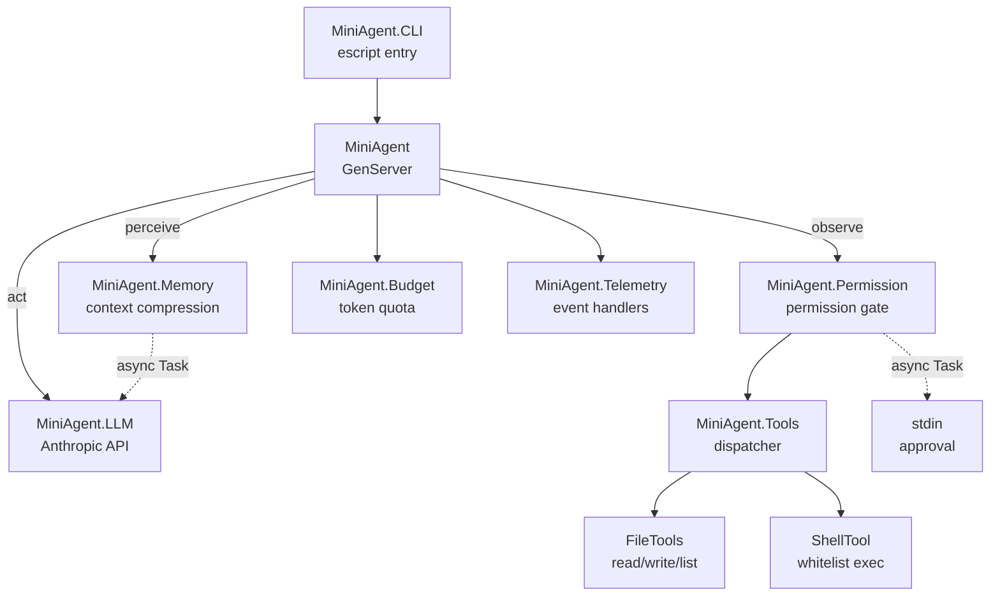

# Mini Agent

A soft real-time, allocation-conscious Elixir/OTP coding agent that drives a
**perceive -> act -> observe** loop against the Anthropic Claude API.

The agent can read, write, and list files; run whitelisted shell commands; compress
its own context when token usage climbs; and respect a configurable permission gate
before executing dangerous operations. All non-determinism is injected (LLM module,
clock, workspace) so the core logic is fully testable offline with Mox - no API key
required for the test suite.

---

## Architecture



```
lib/
  mini_agent.ex                  # GenServer - main loop
  mini_agent/
    application.ex               # OTP Application + Task.Supervisor
    llm_behaviour.ex             # @callback contracts (enables Mox injection)
    llm.ex                       # Anthropic API client
    budget.ex                    # Token quota - pure struct
    memory.ex                    # Context compression (token-based threshold)
    permission.ex                # :auto | :ask | :readonly gate
    tools.ex                     # Tool registry and dispatcher
    tools/
      file_tools.ex              # read_file, write_file, list_dir
      shell_tool.ex              # Whitelisted shell commands
    telemetry.ex                 # Sole location for console output
    cli.ex                       # Escript entry point
```

---

## Requirements

- Elixir ~> 1.18 / Erlang/OTP 26+
- `ANTHROPIC_API_KEY` environment variable (production use only - tests run offline)

---

## Quickstart

```bash
# Install dependencies
mix deps.get

# Run tests (no API key needed)
mix test

# Build the escript binary
mix escript.build

# Run with interactive permission prompt (default)
export ANTHROPIC_API_KEY="sk-ant-..."
./mini_agent "Read lib/mini_agent.ex and summarise the architecture, then DONE"

# Run in auto mode - approves all tool calls automatically
./mini_agent --auto "List files in lib/, read mini_agent.ex, then DONE"

# Run in readonly mode - blocks write_file and shell
./mini_agent --mode readonly "List all files under lib/ and count lines, then DONE"

# Or run interactively via IEx
iex -S mix
{:ok, pid} = MiniAgent.start_link("Explain Budget module, then DONE", mode: :auto)
MiniAgent.run(pid)
```

---

## Configuration

All values live in `config/config.exs` and are resolved at compile time via
`Application.compile_env!/2`.

| Key | Default | Description |
|-----|---------|-------------|
| `:model` | `"claude-sonnet-4-20250514"` | Anthropic model name |
| `:max_iterations` | `8` | Hard cap on perceive-act-observe cycles |
| `:max_tokens` | `2048` | Max tokens per LLM response |
| `:token_budget` | `50_000` | Total token spend cap per agent run |
| `:compress_token_threshold` | `8_000` | Tokens consumed before context compression fires |
| `:workspace` | `File.cwd!()` | Sandbox root - all file/shell ops are restricted to this path |
| `:llm_module` | `MiniAgent.LLM` | LLM implementation module (swap to `MiniAgent.MockLLM` in tests) |

---

## Permission Modes

| Mode | Behaviour |
|------|-----------|
| `:ask` (default) | Prompts stdin for approval before running `write_file` or `shell` |
| `:auto` | Approves all tool calls silently - use in trusted environments |
| `:readonly` | Blocks `write_file` and `shell`; all read operations proceed freely |

The `:ask` approval prompt runs inside a supervised `Task` so the agent GenServer
mailbox is never blocked while waiting for user input.

---

## Shell Tool Whitelist

The `shell` tool only accepts the following commands:

```
cat  echo  find  git  grep  head  ls  mix  tail  wc
```

All commands are sandboxed to `:workspace`. Output is capped at 4 000 bytes.

---

## Context Compression

When cumulative token usage exceeds `:compress_token_threshold`, the oldest
messages are summarized in a background `Task` (non-blocking) and replaced with a
single `[CONTEXT SUMMARY]` message. The most recent 4 messages are always kept
verbatim.

---

## Development

```bash
# Lint
mix credo --strict

# Static analysis
mix dialyzer

# Format
mix format

# Full CI sequence (matches copilot-instructions.md)
mix format && \
mix compile --warnings-as-errors && \
mix credo --strict && \
mix test --warnings-as-errors
```

---

## Testing

The test suite runs entirely offline - no API key required. The `MiniAgent.LLM`
module is replaced by `MiniAgent.MockLLM` (a Mox double) in the test environment
via `config/test.exs`.

```bash
mix test                         # all tests
mix test test/mini_agent_test.exs  # integration tests only
mix test test/mini_agent/budget_test.exs  # unit tests for a single module
```

Test categories:

| File | Type | Notes |
|------|------|-------|
| `mini_agent_test.exs` | Integration | Full agent loop, MockLLM, tool dispatch |
| `budget_test.exs` | Unit | Pure struct functions |
| `memory_test.exs` | Unit | Threshold logic + compression path |
| `permission_test.exs` | Unit | `:auto` and `:readonly` modes |
| `tools_test.exs` | Unit | Dispatcher, file read/write in tmp/ |
| `llm_test.exs` | Unit | `extract_text`, `extract_tool_calls`, `usage` |

---

## MVP Roadmap

| MVP | Feature | Status |
|-----|---------|--------|
| 1 | GenServer loop + Anthropic LLM | Done |
| 2 | Tool calling - file read/write/list | Done |
| 3 | Context compression (token-based) | Done |
| 4 | Permission gate + token budget | Done |
| 5 | Shell tool + telemetry logger + CLI | Done |
