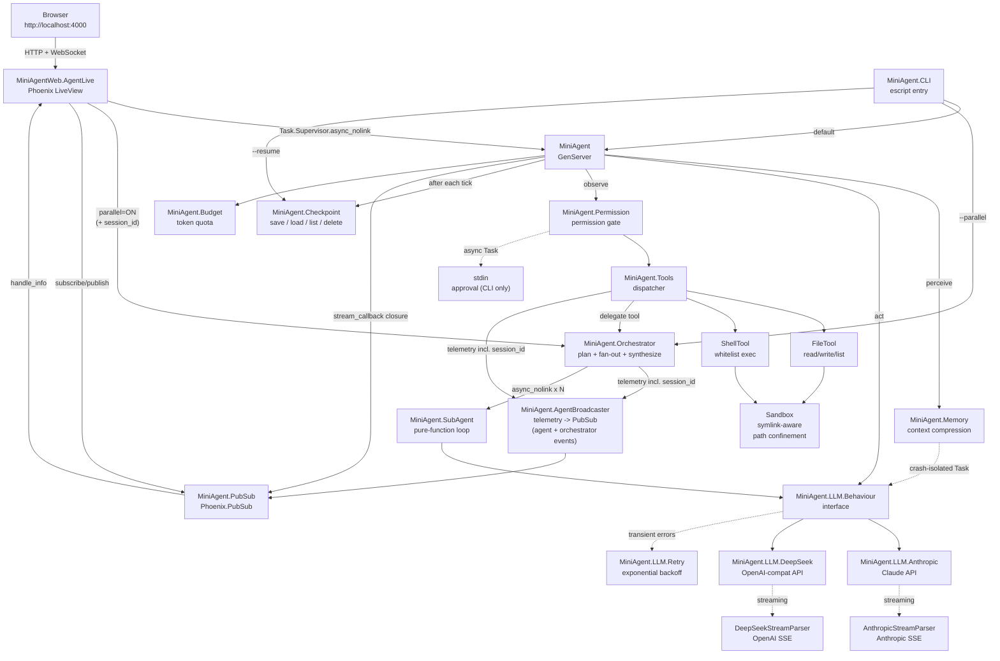
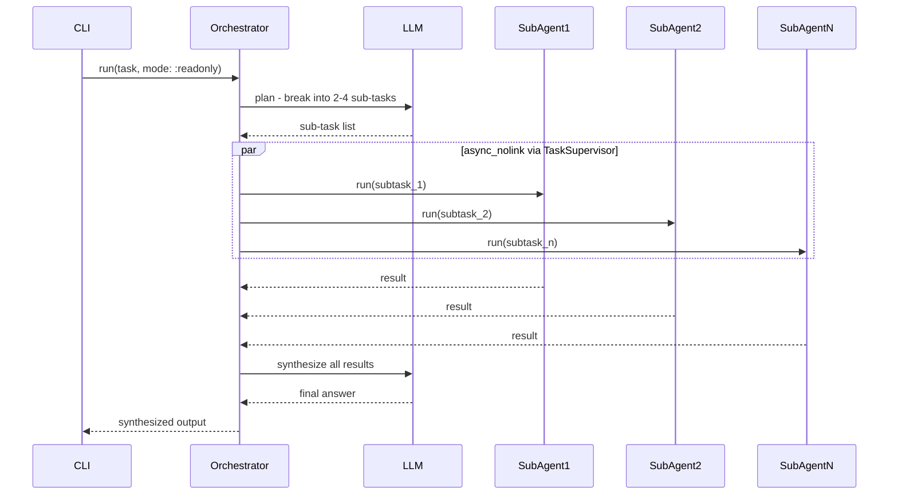

# Mini Agent

A soft real-time, allocation-conscious Elixir/OTP coding agent that drives a
**perceive -> act -> observe** loop against a configurable LLM backend.

  The agent can read, write, and list files; run whitelisted shell commands; compress
its own context when token usage climbs; stream tokens in real-time as they arrive;
decompose complex tasks into parallel sub-agents for fan-out execution; and
**save its full state to disk after every iteration so it can resume exactly where it
left off** after a crash, network drop, or manual interruption. A configurable
permission gate guards dangerous operations. All non-determinism is injected (LLM
module, clock, workspace) so the core logic is fully testable offline with Mox - no
API key required for the test suite.

Accessible via **CLI (escript)** or a built-in **Phoenix LiveView web UI** at
`http://localhost:4000` with real-time streaming output, live activity feed (iterations,
tool calls, sub-agent progress), mode selector, parallel toggle, workspace override, and
session resume - all without leaving the browser.

Two LLM backends are included out of the box:

- **`MiniAgent.LLM.DeepSeek`** (default) - OpenAI-compatible endpoint, requires `DEEPSEEK_API_KEY`
  - Real-time token streaming via OpenAI SSE format (`--stream` flag / always-on in LiveView)
- **`MiniAgent.LLM.Anthropic`** - Anthropic Claude API, requires `ANTHROPIC_API_KEY`
  - Real-time token streaming via Anthropic SSE format (`--stream` flag / always-on in LiveView)

---

## Architecture



```
lib/
  mini_agent.ex                  # GenServer - main loop (accepts session_id:, workspace:, stream_callback: opts)
  mini_agent/
    application.ex               # OTP Application: TaskSupervisor + PubSub + Endpoint
    agent_broadcaster.ex         # Telemetry -> PubSub bridge (session-aware routing)
    llm/
      behaviour.ex               # @callback contracts (enables Mox injection)
      retry.ex                   # Exponential-backoff retry wrapper for LLM calls
      anthropic.ex               # Anthropic Claude API client + SSE streaming
      anthropic_stream_parser.ex # Pure SSE parser - Anthropic event format
      deepseek.ex                # DeepSeek API client (OpenAI-compat adapter)
      deepseek_stream_parser.ex  # Pure SSE parser - OpenAI event format
    budget.ex                    # Token quota - pure struct
    checkpoint.ex                # Checkpoint save/load/list/delete - JSON on disk
    memory.ex                    # Context compression (token-based threshold)
    permission.ex                # :auto | :ask | :readonly gate
    tools.ex                     # Tool registry and dispatcher (execute/3 + ToolContext)
    tools/
      context.ex                 # ToolContext struct - mode + workspace + session_id + llm_module
      file_tool.ex               # read_file (with offset), write_file, list_dir
      sandbox.ex                 # Shared path-confinement logic (symlink-aware boundary)
      shell_tool.ex              # Whitelisted shell commands, sandboxed via Sandbox module
    sub_agent.ex                 # Lightweight pure-function agent loop
    orchestrator.ex              # plan -> parallel fan-out -> synthesize
    telemetry.ex                 # Sole location for log output to console
    cli.ex                       # Escript entry point
  mini_agent_web/
    endpoint.ex                  # Bandit HTTP + WebSocket, Plug pipeline
    router.ex                    # live "/" -> AgentLive
    components/
      layouts.ex                 # Root layout with Tailwind CDN + Phoenix LiveView JS
      layouts/root.html.heex
    live/
      agent_live.ex              # LiveView: task form, options panel, sessions panel,
                                 # streaming output, activity feed
```

---

## Requirements

- Elixir ~> 1.18 / Erlang/OTP 26+
- An API key for the chosen LLM backend (only needed for production use - tests run offline):

| Backend | Env var | Notes |
|---------|---------|-------|
| `MiniAgent.LLM.DeepSeek` (default) | `DEEPSEEK_API_KEY` | OpenAI-compatible endpoint, real-time streaming |
| `MiniAgent.LLM.Anthropic` | `ANTHROPIC_API_KEY` | Anthropic Claude API, real-time streaming |

---

## Quickstart

```bash
# Install dependencies
mix deps.get

# Run tests (no API key needed)
mix test

# Build the escript binary
mix escript.build
```

### Web UI (recommended for interactive use)

```bash
# Store your API key
echo 'export DEEPSEEK_API_KEY="sk-..."' > .env
source .env

# Start the server
MIX_ENV=dev mix run --no-halt
# Or in interactive shell:
MIX_ENV=dev iex -S mix

# Open http://localhost:4000
```

The web UI provides:

| Feature | Description |
|---------|-------------|
| Task input | Multi-line textarea, submit with Enter or Run button |
| Streaming output | LLM tokens appear in real-time as they arrive |
| Activity feed | Live telemetry: iterations, tool calls, budget status, sub-agent progress (plan / start / done / synthesize) |
| **⚙ Options** | Mode toggle (ask/readonly/auto), Parallel on/off, Workspace override |
| **⟳ Sessions** | List saved checkpoints, resume incomplete sessions |

### Default backend: DeepSeek (CLI)

```bash
# Store your key in a .env file (gitignored)
echo 'export DEEPSEEK_API_KEY="sk-..."' > .env
source .env

# Interactive permission prompt (default)
./mini_agent "Read lib/mini_agent.ex and summarise the architecture"

# Auto mode - approves all tool calls silently
./mini_agent --auto "List files in lib/ and count how many there are"

# Readonly mode - blocks write_file and shell
./mini_agent --mode readonly "List all files under lib/"

# Streaming - tokens appear on terminal as they arrive (DeepSeek SSE)
./mini_agent --stream --mode readonly "What does the Budget module do?"

# Orchestrator mode - decomposes task into parallel sub-agents
./mini_agent --parallel --mode readonly \
  "Analyse this codebase: architecture, tools available, and budget management"

# Combine: streaming + orchestrator
./mini_agent --stream --parallel --mode readonly \
  "Describe the LLM layer and list all tools"

# Target a different project without recompiling
./mini_agent --workspace /path/to/other/project --mode readonly \
  "Summarise the architecture"
```

### Anthropic backend (CLI)

Edit `config/config.exs`:

```elixir
config :mini_agent,
  model: "claude-sonnet-4-20250514",
  llm_module: MiniAgent.LLM.Anthropic
```

```bash
export ANTHROPIC_API_KEY="sk-ant-..."

# Standard run
./mini_agent "Read lib/mini_agent.ex and summarise the architecture"

# Streaming - tokens appear on terminal as they arrive (Anthropic SSE)
./mini_agent --stream "Explain how the agent loop works"

# Orchestrator mode
./mini_agent --parallel --mode readonly \
  "Analyse architecture, tools, and budget in parallel"
```

### IEx interactive

```elixir
iex -S mix

# Standard run
{:ok, pid} = MiniAgent.start_link("Explain Budget module", mode: :auto)
MiniAgent.run(pid)

# Autosave enabled - checkpoint written after every iteration
{:ok, pid} = MiniAgent.start_link("Explain Budget module", mode: :auto, autosave: true)
sid = :sys.get_state(pid).session_id
MiniAgent.run(pid)

# Resume a previous session
{:ok, pid} = MiniAgent.resume(sid, autosave: true)
MiniAgent.run(pid)

# Streaming run (tokens printed as they arrive)
{:ok, pid} = MiniAgent.start_link("Explain GenServer loop",
  mode: :auto, stream: true)
MiniAgent.run(pid)

# Orchestrator directly (pass session_id for LiveView Activity feed)
MiniAgent.Orchestrator.run("Analyse architecture, tools, and budget",
  mode: :readonly)

# Checkpoint helpers
MiniAgent.Checkpoint.list()
MiniAgent.Checkpoint.load("1750000000-a3f9c1")
MiniAgent.Checkpoint.delete("1750000000-a3f9c1")
```

---

## Configuration

All values live in `config/config.exs`. Hot-path constants are resolved at compile
time via `Application.compile_env!/2`. The `:workspace` key is the exception - it is
read at **runtime** via `Application.get_env/3` so the `--workspace` CLI flag can
override it without recompiling.

| Key | Default | Description |
|-----|---------|-------------|
| `:model` | `"deepseek-chat"` | LLM model name passed to the active backend |
| `:max_iterations` | `8` | Hard cap on perceive-act-observe cycles per agent run |
| `:max_tokens` | `2048` | Max tokens per LLM response. Increase to `4096`+ for large file reads |
| `:token_budget` | `50_000` | Total token spend cap per agent run |
| `:compress_token_threshold` | `8_000` | Tokens consumed before context compression fires |
| `:workspace` | `File.cwd!()` | Sandbox root - all file/shell ops restricted to this path. Overridable at runtime via `--workspace` flag |
| `:llm_module` | `MiniAgent.LLM.DeepSeek` | LLM implementation module |
| `:shell_whitelist` | `~w[ls cat grep find wc head tail echo mix git rg fd bat]` | Allowed shell commands |
| `:checkpoint_dir` | `".mini_agent/checkpoints"` | Directory for checkpoint JSON files (relative to cwd) |

Available `:llm_module` values:

| Module | Streaming | Notes |
|--------|-----------|-------|
| `MiniAgent.LLM.DeepSeek` | OpenAI SSE | Default. `DEEPSEEK_API_KEY` required |
| `MiniAgent.LLM.Anthropic` | Anthropic SSE | `ANTHROPIC_API_KEY` required |
| `MiniAgent.MockLLM` | N/A | Test environment only - Mox double, no network |

### Web UI configuration

The endpoint is configured in `config/config.exs`:

```elixir
config :mini_agent, MiniAgentWeb.Endpoint,
  adapter: Bandit.PhoenixAdapter,
  http: [ip: {127, 0, 0, 1}, port: 4000],
  server: true,
  secret_key_base: "...",      # min 64 bytes
  live_view: [signing_salt: "miniagnt"]
```

To disable the web UI entirely (e.g. escript-only builds), add `server: false` to the
relevant config environment file.

---

## CLI Flags

```
./mini_agent [FLAGS] "task description"
```

| Flag | Alias | Description |
|------|-------|-------------|
| `--auto` | `-a` | Approve all tool calls silently (`:auto` mode) |
| `--mode readonly` | `-m readonly` | Block `write_file` and `shell` (`:readonly` mode) |
| `--stream` | `-s` | Enable real-time token streaming (both backends) |
| `--parallel` | `-p` | Orchestrator mode: decompose task into parallel sub-agents |
| `--workspace <path>` | `-w <path>` | Override sandbox workspace root at runtime (no recompile needed) |
| `--list` | `-l` | List all saved checkpoints with status and token counts |
| `--resume <id>` | `-r <id>` | Resume an in-progress session from its last checkpoint |
| `--delete <id>` | | Delete a checkpoint file |

Flags can be combined: `--stream --parallel --mode readonly`.

---

## Checkpoint and Resume

Every agent run is assigned a **session ID** (`unix_ts-hex6`, e.g. `1750000000-a3f9c1`).
The timestamp uses `:erlang.system_time(:second)` (wall-second clock - not monotonic;
suitable for session IDs and audit logs, not duration measurement) for sortable IDs. With `autosave: true` (default for CLI), the agent writes a snapshot to
`.mini_agent/checkpoints/<session_id>.json` after **every completed iteration**.
An append-only `.history` file records the timestamp of each save for audit.

If the process crashes, the network drops, or the user presses Ctrl-C, the `terminate/2`
callback flushes a final checkpoint before the process exits.

On resume, the agent reconstructs the full `%MiniAgent.State{}` from JSON and continues
from iteration N+1 - no tokens are re-spent for work already completed.

### Checkpoint commands

```bash
# See all saved sessions, newest first
./mini_agent --list

# Continue an in-progress session
./mini_agent --resume 1750000000-a3f9c1

# Resume with streaming output
./mini_agent --stream --resume 1750000000-a3f9c1

# Remove a checkpoint
./mini_agent --delete 1750000000-a3f9c1
```

Sample `--list` output:

```
Saved sessions:

  1750000000-a3f9c1
    in progress - iteration 3 - 8420 tokens - 2026-06-22T10:15:33.421Z
    task: Read lib/mini_agent.ex and summarise the architectur...

  1749990000-b1c2d3
    done - iteration 6 - 21340 tokens - 2026-06-22T09:02:11.004Z
    task: List all tools and explain each one...
```

### Checkpoint JSON format

The checkpoint file is plain JSON, human-readable and diff-friendly:

```json
{
  "version": 1,
  "session_id": "1750000000-a3f9c1",
  "saved_at": "2026-06-22T10:15:33.421Z",
  "task": "Read lib/mini_agent.ex and summarise the architecture",
  "mode": "readonly",
  "workspace": "/home/user/projects/my_app",
  "iterations": 3,
  "done": false,
  "output": "The architecture is...",
  "budget": { "used": 8420, "limit": 50000 },
  "messages": [
    { "role": "user", "content": "Read lib/mini_agent.ex..." },
    { "role": "assistant", "content": [ { "type": "text", "text": "..." } ] }
  ]
}
```

### What is and is not persisted

| Field | Persisted | Notes |
|-------|-----------|-------|
| `task`, `mode`, `iterations`, `done`, `output` | Yes | Core loop state |
| `workspace` | Yes | Sandbox root - restored on resume so the agent targets the correct directory |
| `budget.used` / `budget.limit` | Yes | Token accounting |
| `messages` | Yes | Full conversation history, string-key normalised |
| `session_id` | Yes | Stable across resume cycles |
| `stream_callback` | No | Runtime function - reset to `nil` on resume |
| `tool_calls`, `last` | No | Per-iteration scratch - reset to `[]` / `nil` on resume |

Transient fields are always safe to drop because they are repopulated within the same
iteration in which they were set.

---

## Permission Modes

| Mode | Behaviour |
|------|-----------|
| `:ask` (default) | Prompts stdin for approval before running `write_file` or `shell` |
| `:auto` | Approves all tool calls silently - use in trusted environments |
| `:readonly` | Blocks `write_file` and `shell`; all read operations proceed freely |

The `:ask` approval prompt runs inside a supervised `Task` so the agent GenServer
mailbox is never blocked while waiting for user input.

Sub-agents spawned by the `delegate` tool or `--parallel` flag **inherit the calling
agent's permission mode**. One exception: **`:ask` is automatically downgraded to
`:readonly` in the orchestrator**. Parallel Tasks cannot safely share a single stdin
file descriptor - concurrent `IO.gets` calls would race and interleave prompts. If you
want sub-agents to approve dangerous tools without interaction, pass `--mode auto`
explicitly.

---

## Tools

| Tool | Dangerous? | Description |
|------|-----------|-------------|
| `read_file` | No | Read file contents within workspace (4 000 bytes per call, pageable via `offset`) |
| `list_dir` | No | List directory contents |
| `write_file` | Yes | Write content to a file (blocked in `:readonly`) |
| `shell` | Yes | Run a whitelisted shell command (blocked in `:readonly`) |
| `delegate` | No | Decompose a complex task into parallel sub-agents via `Orchestrator` |

The `delegate` tool is excluded from sub-agent tool lists (`Tools.safe_definitions/0`)
to prevent recursive fan-out.

### read_file pagination

Large files are read in 4 000-byte pages. When a file exceeds the limit, the output
ends with a truncation hint:

```
[truncated - 12500 bytes remaining, use offset: 4000]
```

Pass `offset` to read the next page:

```json
{ "name": "read_file", "input": { "path": "lib/big_file.ex", "offset": 4000 } }
```

The LLM is instructed to page through files automatically when it encounters the
truncation hint.

### Shell Tool Whitelist

```
cat  echo  find  git  grep  head  ls  mix  tail  wc  rg  fd  bat
```

All commands are sandboxed to `:workspace`. Output is capped at 4 000 bytes.

---

## LLM Retry

Transient LLM API failures (rate limits, temporary service unavailability, network
issues) are automatically retried with **exponential backoff** before the error is
surfaced to the agent loop.

| Parameter | Value |
|-----------|-------|
| Max retries | 3 |
| Backoff schedule | 1 s, 2 s, 4 s (7 s total) |
| Retryable errors | HTTP 429, HTTP 503, `timeout`, `econnrefused`, `connection refused` |
| Non-retryable | HTTP 4xx (except 429), HTTP 5xx (except 503), domain errors |

Retry is applied to all `chat/2` calls. **Streaming `chat_stream/3` is not retried**
because partial SSE chunks may already have been emitted to the caller before a
mid-stream error occurs.

---

## Streaming

When `--stream` is passed (or `stream: true` in `start_link/2`), the agent calls
`MiniAgent.LLM.Behaviour.chat_stream/3` instead of `chat/2`. Text tokens are printed
to the terminal as each SSE chunk arrives. Both backends support real-time streaming
with dedicated pure-function SSE parsers.

### Anthropic SSE format (`AnthropicStreamParser`)

| Event | Action |
|-------|--------|
| `message_start` | Accumulates input token count |
| `content_block_start` | Opens text or tool_use block |
| `content_block_delta` / `text_delta` | Emits text chunk immediately to terminal |
| `content_block_delta` / `input_json_delta` | Accumulates partial tool JSON |
| `content_block_stop` | Finalizes tool call with parsed JSON input |
| `message_delta` | Accumulates output token count and stop reason |

### OpenAI SSE format (`DeepSeekStreamParser`)

| Event | Action |
|-------|--------|
| `choices[].delta.content` | Emits text chunk immediately to terminal |
| `choices[].delta.tool_calls[index]` | Accumulates tool id/name/args per slot index |
| `choices[].finish_reason` | Records stop reason |
| `usage.prompt_tokens` / `completion_tokens` | Accumulates token counts (final chunk) |
| `data: [DONE]` | End-of-stream terminator, no-op |

Both parsers convert their accumulated state to the same internal Anthropic-like
response map via `to_response/1`, so the agent loop processes streamed and
non-streamed responses identically.

All SSE parsing is implemented with binary pattern matching on `"data: " <> json`
lines - no byte-by-byte parsing, no atoms created at runtime.

The Req `:into` callback streams raw HTTP body chunks into a short-lived `Agent`
(started under `MiniAgent.TaskSupervisor`) that accumulates parser state. The
`Agent` is always stopped in an `after` block, preventing leaks on network errors.

---

## Sub-agents and Orchestrator

The `--parallel` flag (or calling `MiniAgent.Orchestrator.run/2` directly, or the
agent using the `delegate` tool) triggers the 3-phase orchestrator:



Sub-agent constraints:

| Parameter | Value |
|-----------|-------|
| Max iterations per sub-agent | 8 |
| Token budget per sub-agent | 25 000 |
| Mode | Inherits from caller (`:ask` downgraded to `:readonly` in parallel context) |
| Recursive delegation | Blocked (`delegate` excluded from `safe_definitions/0`) |
| Timeout per sub-agent | 120 s (> worst-case 8 iter x 7 s retry backoff = 56 s) |
| Failure handling | `yield_many` - one crash/timeout does not abort other sub-agents |

> **Budget note:** Sub-agent budgets are independent (shared-nothing). Total token
> spend for a parallel run = orchestrator calls (plan + synthesize) + sum of all
> sub-agent budgets. With 4 sub-agents at 25 000 tokens each, real spend can reach
> ~105 000 tokens regardless of the main agent's `token_budget` setting.

---

## Context Compression

When cumulative token usage exceeds `:compress_token_threshold`, the oldest
messages are summarized via a crash-isolated `Task` and replaced with a single
`[CONTEXT SUMMARY]` message. The most recent 4 messages are always kept verbatim.

The compression split point is adjusted to **never orphan a `tool_result` message**
from its preceding `tool_use`. If no safe split exists (the entire history up to the
split boundary consists of tool turns), the compression round is skipped rather than
producing an invalid message sequence.

---

## Loop Termination

The agent loop (`perceive -> act -> observe -> tick`) terminates when any of the
following conditions is met:

| Condition | Message |
|-----------|---------|
| LLM response contains `DONE:` | Output is the full response text |
| `max_iterations` reached | `"Max iterations (N) reached"` |
| Token budget exhausted | `"Budget exceeded. Token: X/Y (Z%)"` |
| LLM returns an error (after retries) | `"LLM error: ..."` |

**`DONE:` detection** uses `String.contains?/2` - the word `DONE:` can appear
anywhere in the LLM response, not just at the start. This accommodates natural
phrasing like `"Here is the summary: [...] DONE: task complete."`.

**Iteration nudge** - from iteration 2 onwards, a reminder is appended alongside
each tool result message:
> *"You have used tools across N iterations. If you have enough information,
> provide your final answer now and include 'DONE:' in the response."*

This prevents the LLM from over-exploring when it already has the data it needs.

---

## Development

```bash
# Format
mix format

# Compile (strict)
mix compile --warnings-as-errors

# Lint
mix credo --strict

# Static analysis
mix dialyzer

# Full CI sequence
mix format && \
mix compile --warnings-as-errors && \
mix credo --strict && \
mix dialyzer && \
mix test --warnings-as-errors
```

---

## Testing

The test suite runs entirely offline - no API key required. The `llm_module` config
key is overridden to `MiniAgent.MockLLM` (a Mox double) in the test environment
via `config/test.exs`.

```bash
mix test                                                          # all tests
mix test test/mini_agent_test.exs                                 # integration tests only
mix test test/mini_agent/budget_test.exs                          # unit tests for a single module
mix test test/mini_agent/checkpoint_test.exs                      # checkpoint save/load/list/delete
mix test test/mini_agent/tools/sandbox_test.exs                   # Sandbox path confinement unit tests
mix test test/mini_agent/llm/retry_test.exs                       # retry backoff unit tests
mix test test/mini_agent/llm/anthropic_stream_parser_test.exs     # Anthropic SSE parser unit tests
mix test test/mini_agent/llm/deepseek_stream_parser_test.exs      # DeepSeek SSE parser unit tests
mix test test/mini_agent/sub_agent_test.exs                       # SubAgent unit tests
mix test test/mini_agent/orchestrator_test.exs                    # Orchestrator unit tests
```

Test categories:

| File | Type | Notes |
|------|------|-------|
| `mini_agent_test.exs` | Integration | Full agent loop, MockLLM, tool dispatch |
| `budget_test.exs` | Unit | Pure struct functions |
| `checkpoint_test.exs` | Unit | save/load round-trip, version guard, list, delete, clock injection |
| `memory_test.exs` | Unit | Threshold logic, compression path, tool_use/tool_result boundary safety |
| `permission_test.exs` | Unit | `:auto` and `:readonly` modes |
| `tools_test.exs` | Unit | Dispatcher, file read/write/offset pagination in tmp/ |
| `tools/sandbox_test.exs` | Unit | Path confinement, symlink resolution, boundary checks |
| `llm_test.exs` | Unit | `extract_text`, `extract_tool_calls`, `usage` for Anthropic |
| `llm/deepseek_test.exs` | Unit | `extract_text`, `extract_tool_calls`, `usage` for DeepSeek |
| `llm/retry_test.exs` | Unit | Retryable vs non-retryable errors, max retries, backoff call count |
| `llm/anthropic_stream_parser_test.exs` | Unit | Anthropic SSE parsing, tool lifecycle, token counting, round-trip |
| `llm/deepseek_stream_parser_test.exs` | Unit | OpenAI SSE parsing, tool slot accumulation, round-trip |
| `sub_agent_test.exs` | Unit | Loop termination, tool execution, budget/iteration caps |
| `orchestrator_test.exs` | Unit | Plan/fanout/synthesize phases, failure fallbacks |

---

## Feature Roadmap

| Module | Feature | Status |
|--------|---------|--------|
| 1 | GenServer loop + Anthropic LLM | Done |
| 2 | Tool calling - file read/write/list | Done |
| 3 | Context compression (token-based) | Done |
| 4 | Permission gate + token budget | Done |
| 5 | Shell tool + telemetry logger + CLI | Done |
| 6 | DeepSeek backend (OpenAI-compat adapter) | Done |
| 7 | Real-time streaming - Anthropic SSE + DeepSeek SSE | Done |
| 8 | Sub-agents + Orchestrator (parallel fan-out) | Done |
| 9 | Checkpoint and resume (save/restore agent state) | Done |
| 10 | read_file offset pagination | Done |
| 11 | LLM retry with exponential backoff | Done |
| 12 | Runtime workspace override (--workspace flag) | Done |
| 13 | ToolContext propagation - workspace threaded explicitly through dispatch | Done |
| 14 | :ask + --parallel safety - downgrade to :readonly, emit telemetry | Done |
| 15 | Phoenix LiveView web UI - streaming output, activity feed (single + parallel), mode/parallel/workspace options, session resume | Done |
| 16 | Parallel mode real-time Activity feed - sub-agent plan/start/done/synthesize events | Done |
| 17 | Sandbox path confinement - shared symlink-aware boundary for FileTool and ShellTool | Done |
| 18 | Finch HTTP adapter - connection pooling for LLM API calls | Done |
| 19 | MCP integration (Model Context Protocol tools) | Planned |
