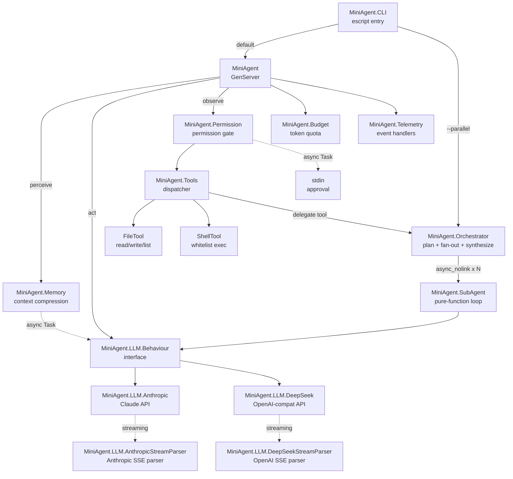
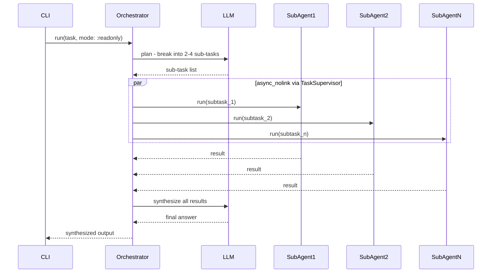

# Mini Agent

A soft real-time, allocation-conscious Elixir/OTP coding agent that drives a
**perceive -> act -> observe** loop against a configurable LLM backend.

The agent can read, write, and list files; run whitelisted shell commands; compress
its own context when token usage climbs; stream tokens in real-time as they arrive;
and decompose complex tasks into parallel sub-agents for fan-out execution. A
configurable permission gate guards dangerous operations. All non-determinism is
injected (LLM module, clock, workspace) so the core logic is fully testable offline
with Mox - no API key required for the test suite.

Two LLM backends are included out of the box:

- **`MiniAgent.LLM.DeepSeek`** (default) - OpenAI-compatible endpoint, requires `DEEPSEEK_API_KEY`
  - Real-time token streaming via OpenAI SSE format (`--stream` flag)
- **`MiniAgent.LLM.Anthropic`** - Anthropic Claude API, requires `ANTHROPIC_API_KEY`
  - Real-time token streaming via Anthropic SSE format (`--stream` flag)

---

## Architecture



```
lib/
  mini_agent.ex                  # GenServer - main loop
  mini_agent/
    application.ex               # OTP Application + Task.Supervisor
    llm/
      behaviour.ex               # @callback contracts (enables Mox injection)
      anthropic.ex               # Anthropic Claude API client + SSE streaming
      anthropic_stream_parser.ex # Pure SSE parser - Anthropic event format
      deepseek.ex                # DeepSeek API client (OpenAI-compat adapter)
      deepseek_stream_parser.ex  # Pure SSE parser - OpenAI event format
    budget.ex                    # Token quota - pure struct
    memory.ex                    # Context compression (token-based threshold)
    permission.ex                # :auto | :ask | :readonly gate
    tools.ex                     # Tool registry and dispatcher (incl. delegate)
    tools/
      file_tool.ex               # read_file, write_file, list_dir
      shell_tool.ex              # Whitelisted shell commands
    sub_agent.ex                 # Lightweight pure-function agent loop
    orchestrator.ex              # plan -> parallel fan-out -> synthesize
    telemetry.ex                 # Sole location for console output
    cli.ex                       # Escript entry point
```

---

## Requirements

- Elixir ~> 1.18 / Erlang/OTP 26+
- An API key for the chosen LLM backend (only needed for production use - tests run offline):

| Backend | Env var | Notes |
|---------|---------|-------|
| `MiniAgent.LLM.DeepSeek` (default) | `DEEPSEEK_API_KEY` | OpenAI-compatible endpoint, real-time streaming |
| `MiniAgent.LLM.Anthropic` | `ANTHROPIC_API_KEY` | Anthropic Claude API, real-time streaming |

---

## Quickstart

```bash
# Install dependencies
mix deps.get

# Run tests (no API key needed)
mix test

# Build the escript binary
mix escript.build
```

### Default backend: DeepSeek

```bash
# Store your key in a .env file (gitignored)
echo 'export DEEPSEEK_API_KEY="sk-..."' > .env
source .env

# Interactive permission prompt (default)
./mini_agent "Read lib/mini_agent.ex and summarise the architecture"

# Auto mode - approves all tool calls silently
./mini_agent --auto "List files in lib/ and count how many there are"

# Readonly mode - blocks write_file and shell
./mini_agent --mode readonly "List all files under lib/"

# Streaming - tokens appear on terminal as they arrive (DeepSeek SSE)
./mini_agent --stream --mode readonly "What does the Budget module do?"

# Orchestrator mode - decomposes task into parallel sub-agents
./mini_agent --parallel --mode readonly \
  "Analyse this codebase: architecture, tools available, and budget management"

# Combine: streaming + orchestrator
./mini_agent --stream --parallel --mode readonly \
  "Describe the LLM layer and list all tools"
```

### Anthropic backend

Edit `config/config.exs`:

```elixir
config :mini_agent,
  model: "claude-sonnet-4-20250514",
  llm_module: MiniAgent.LLM.Anthropic
```

```bash
export ANTHROPIC_API_KEY="sk-ant-..."

# Standard run
./mini_agent "Read lib/mini_agent.ex and summarise the architecture"

# Streaming - tokens appear on terminal as they arrive (Anthropic SSE)
./mini_agent --stream "Explain how the agent loop works"

# Orchestrator mode
./mini_agent --parallel --mode readonly \
  "Analyse architecture, tools, and budget in parallel"
```

### IEx interactive

```elixir
iex -S mix

# Standard run
{:ok, pid} = MiniAgent.start_link("Explain Budget module", mode: :auto)
MiniAgent.run(pid)

# Streaming run (tokens printed as they arrive)
{:ok, pid} = MiniAgent.start_link("Explain GenServer loop",
  mode: :auto, stream: true)
MiniAgent.run(pid)

# Orchestrator directly
MiniAgent.Orchestrator.run("Analyse architecture, tools, and budget",
  mode: :readonly)
```

---

## Configuration

All values live in `config/config.exs` and are resolved at compile time via
`Application.compile_env!/2`.

| Key | Default | Description |
|-----|---------|-------------|
| `:model` | `"deepseek-chat"` | LLM model name passed to the active backend |
| `:max_iterations` | `8` | Hard cap on perceive-act-observe cycles per agent run |
| `:max_tokens` | `2048` | Max tokens per LLM response. Increase to `4096`+ for large file reads |
| `:token_budget` | `50_000` | Total token spend cap per agent run |
| `:compress_token_threshold` | `8_000` | Tokens consumed before context compression fires |
| `:workspace` | `File.cwd!()` | Sandbox root - all file/shell ops are restricted to this path |
| `:llm_module` | `MiniAgent.LLM.DeepSeek` | LLM implementation module |

Available `:llm_module` values:

| Module | Streaming | Notes |
|--------|-----------|-------|
| `MiniAgent.LLM.DeepSeek` | OpenAI SSE | Default. `DEEPSEEK_API_KEY` required |
| `MiniAgent.LLM.Anthropic` | Anthropic SSE | `ANTHROPIC_API_KEY` required |
| `MiniAgent.MockLLM` | N/A | Test environment only - Mox double, no network |

---

## CLI Flags

```
./mini_agent [FLAGS] "task description"
```

| Flag | Alias | Description |
|------|-------|-------------|
| `--auto` | `-a` | Approve all tool calls silently (`:auto` mode) |
| `--mode readonly` | `-m readonly` | Block `write_file` and `shell` (`:readonly` mode) |
| `--stream` | `-s` | Enable real-time token streaming (both backends) |
| `--parallel` | `-p` | Orchestrator mode: decompose task into parallel sub-agents |

Flags can be combined: `--stream --parallel --mode readonly`.

---

## Permission Modes

| Mode | Behaviour |
|------|-----------|
| `:ask` (default) | Prompts stdin for approval before running `write_file` or `shell` |
| `:auto` | Approves all tool calls silently - use in trusted environments |
| `:readonly` | Blocks `write_file` and `shell`; all read operations proceed freely |

The `:ask` approval prompt runs inside a supervised `Task` so the agent GenServer
mailbox is never blocked while waiting for user input.

Sub-agents spawned by the orchestrator always run in `:readonly` mode regardless of
the parent mode, to prevent concurrent writes from racing.

---

## Tools

| Tool | Dangerous? | Description |
|------|-----------|-------------|
| `read_file` | No | Read file contents within workspace |
| `list_dir` | No | List directory contents |
| `write_file` | Yes | Write content to a file (blocked in `:readonly`) |
| `shell` | Yes | Run a whitelisted shell command (blocked in `:readonly`) |
| `delegate` | No | Decompose a complex task into parallel sub-agents via `Orchestrator` |

The `delegate` tool is excluded from sub-agent tool lists (`Tools.safe_definitions/0`)
to prevent recursive fan-out.

### Shell Tool Whitelist

```
cat  echo  find  git  grep  head  ls  mix  tail  wc
```

All commands are sandboxed to `:workspace`. Output is capped at 4 000 bytes.

---

## Streaming

When `--stream` is passed (or `stream: true` in `start_link/2`), the agent calls
`MiniAgent.LLM.Behaviour.chat_stream/3` instead of `chat/2`. Text tokens are printed
to the terminal as each SSE chunk arrives. Both backends support real-time streaming
with dedicated pure-function SSE parsers.

### Anthropic SSE format (`AnthropicStreamParser`)

| Event | Action |
|-------|--------|
| `message_start` | Accumulates input token count |
| `content_block_start` | Opens text or tool_use block |
| `content_block_delta` / `text_delta` | Emits text chunk immediately to terminal |
| `content_block_delta` / `input_json_delta` | Accumulates partial tool JSON |
| `content_block_stop` | Finalizes tool call with parsed JSON input |
| `message_delta` | Accumulates output token count and stop reason |

### OpenAI SSE format (`DeepSeekStreamParser`)

| Event | Action |
|-------|--------|
| `choices[].delta.content` | Emits text chunk immediately to terminal |
| `choices[].delta.tool_calls[index]` | Accumulates tool id/name/args per slot index |
| `choices[].finish_reason` | Records stop reason |
| `usage.prompt_tokens` / `completion_tokens` | Accumulates token counts (final chunk) |
| `data: [DONE]` | End-of-stream terminator, no-op |

Both parsers convert their accumulated state to the same internal Anthropic-like
response map via `to_response/1`, so the agent loop processes streamed and
non-streamed responses identically.

All SSE parsing is implemented with binary pattern matching on `"data: " <> json`
lines - no byte-by-byte parsing, no atoms created at runtime.

The Req `:into` callback streams raw HTTP body chunks into a short-lived `Agent`
(started under `MiniAgent.TaskSupervisor`) that accumulates parser state. The
`Agent` is always stopped in an `after` block, preventing leaks on network errors.

---

## Sub-agents and Orchestrator

The `--parallel` flag (or calling `MiniAgent.Orchestrator.run/2` directly, or the
agent using the `delegate` tool) triggers the 3-phase orchestrator:



Sub-agent constraints:

| Parameter | Value |
|-----------|-------|
| Max iterations per sub-agent | 8 |
| Token budget per sub-agent | 25 000 |
| Mode | Always `:readonly` |
| Recursive delegation | Blocked (`delegate` excluded from `safe_definitions/0`) |
| Timeout per sub-agent | 120 s |
| Failure handling | `yield_many` - one crash/timeout does not abort other sub-agents |

---

## Loop Termination

The agent loop (`perceive -> act -> observe -> tick`) terminates when any of the
following conditions is met:

| Condition | Message |
|-----------|---------|
| LLM response contains `DONE:` | Output is the full response text |
| `max_iterations` reached | `"Max iterations (N) reached"` |
| Token budget exhausted | `"Budget exceeded. Token: X/Y (Z%)"` |
| LLM returns an error | `"LLM error: ..."` |

**`DONE:` detection** uses `String.contains?/2` - the word `DONE:` can appear
anywhere in the LLM response, not just at the start. This accommodates natural
phrasing like `"Here is the summary: [...] DONE: task complete."`.

**Iteration nudge** - from iteration 2 onwards, a reminder is appended alongside
each tool result message:
> *"You have used tools across N iterations. If you have enough information,
> provide your final answer now and include 'DONE:' in the response."*

This prevents the LLM from over-exploring when it already has the data it needs.

---

## Context Compression

When cumulative token usage exceeds `:compress_token_threshold`, the oldest
messages are summarized in a background `Task` (non-blocking) and replaced with a
single `[CONTEXT SUMMARY]` message. The most recent 4 messages are always kept
verbatim.

---

## Development

```bash
# Format
mix format

# Compile (strict)
mix compile --warnings-as-errors

# Lint
mix credo --strict

# Static analysis
mix dialyzer

# Full CI sequence
mix format && \
mix compile --warnings-as-errors && \
mix credo --strict && \
mix dialyzer && \
mix test --warnings-as-errors
```

---

## Testing

The test suite runs entirely offline - no API key required. The `llm_module` config
key is overridden to `MiniAgent.MockLLM` (a Mox double) in the test environment
via `config/test.exs`.

```bash
mix test                                                        # all tests
mix test test/mini_agent_test.exs                               # integration tests only
mix test test/mini_agent/budget_test.exs                        # unit tests for a single module
mix test test/mini_agent/llm/anthropic_stream_parser_test.exs   # Anthropic SSE parser unit tests
mix test test/mini_agent/llm/deepseek_stream_parser_test.exs    # DeepSeek SSE parser unit tests
mix test test/mini_agent/sub_agent_test.exs                     # SubAgent unit tests
mix test test/mini_agent/orchestrator_test.exs                  # Orchestrator unit tests
```

Test categories:

| File | Type | Notes |
|------|------|-------|
| `mini_agent_test.exs` | Integration | Full agent loop, MockLLM, tool dispatch |
| `budget_test.exs` | Unit | Pure struct functions |
| `memory_test.exs` | Unit | Threshold logic + compression path |
| `permission_test.exs` | Unit | `:auto` and `:readonly` modes |
| `tools_test.exs` | Unit | Dispatcher, file read/write in tmp/ |
| `llm_test.exs` | Unit | `extract_text`, `extract_tool_calls`, `usage` for Anthropic |
| `llm/deepseek_test.exs` | Unit | `extract_text`, `extract_tool_calls`, `usage` for DeepSeek |
| `llm/anthropic_stream_parser_test.exs` | Unit | Anthropic SSE parsing, tool lifecycle, token counting, round-trip |
| `llm/deepseek_stream_parser_test.exs` | Unit | OpenAI SSE parsing, tool slot accumulation, round-trip |
| `sub_agent_test.exs` | Unit | Loop termination, tool execution, budget/iteration caps |
| `orchestrator_test.exs` | Unit | Plan/fanout/synthesize phases, failure fallbacks |

---

## Feature Roadmap

| Module | Feature | Status |
|--------|---------|--------|
| 1 | GenServer loop + Anthropic LLM | Done |
| 2 | Tool calling - file read/write/list | Done |
| 3 | Context compression (token-based) | Done |
| 4 | Permission gate + token budget | Done |
| 5 | Shell tool + telemetry logger + CLI | Done |
| 6 | DeepSeek backend (OpenAI-compat adapter) | Done |
| 7 | Real-time streaming - Anthropic SSE + DeepSeek SSE | Done |
| 8 | Sub-agents + Orchestrator (parallel fan-out) | Done |
| 9 | Checkpoint and resume (save/restore agent state) | Planned |
| 10 | MCP integration (Model Context Protocol tools) | Planned |
